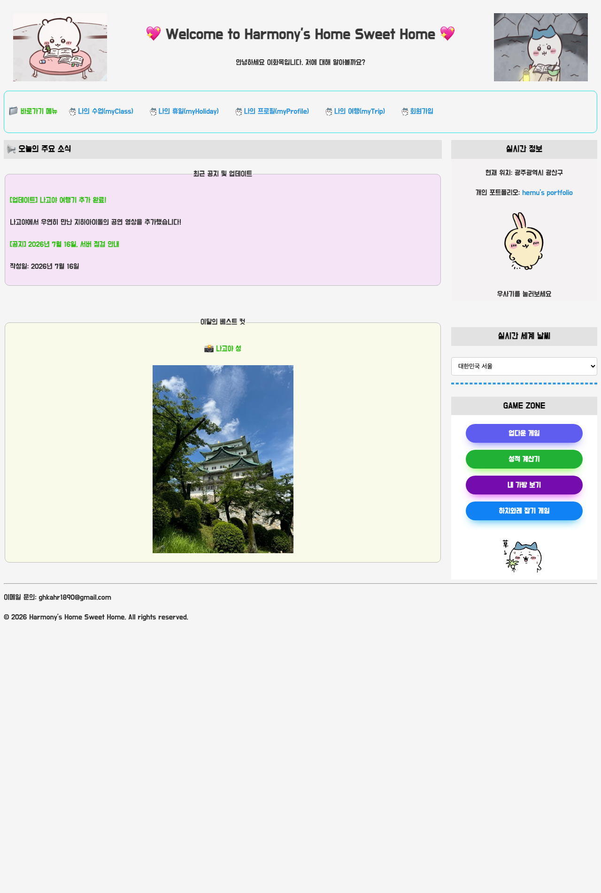
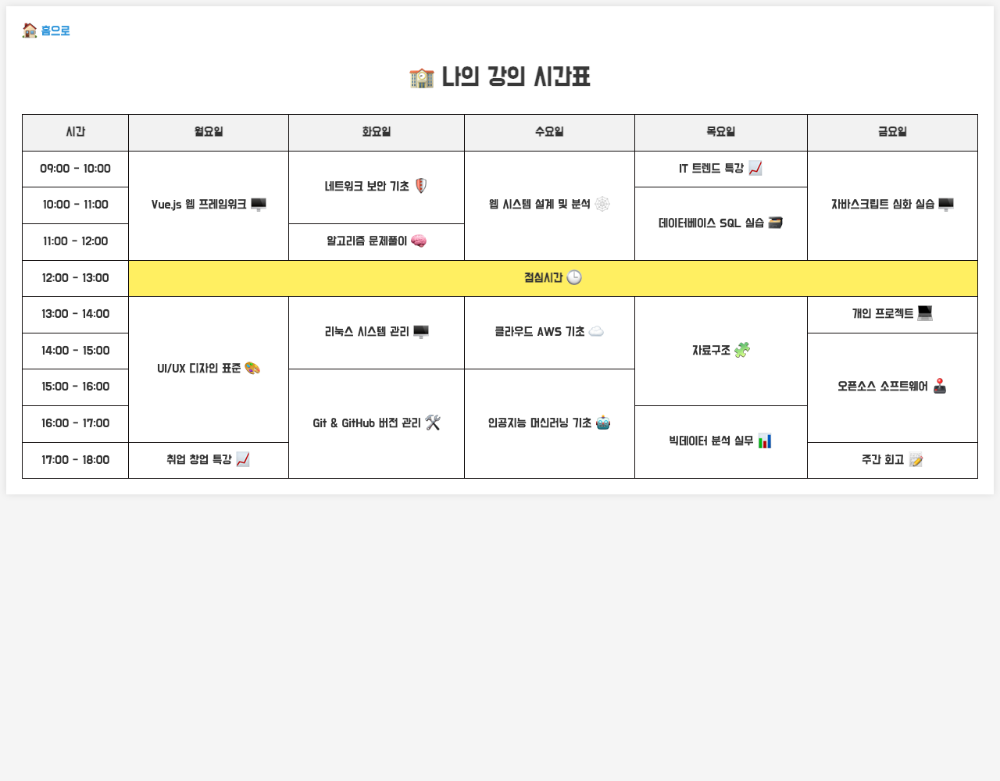
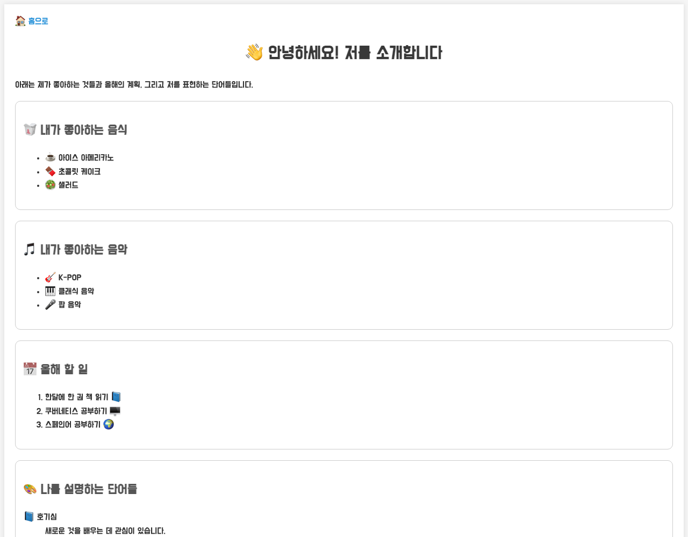
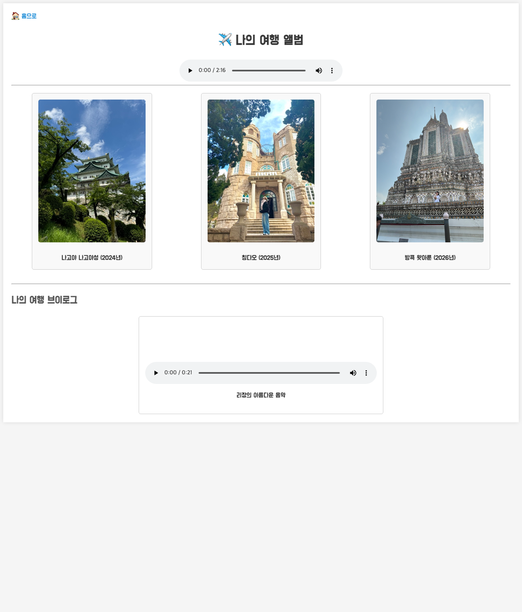
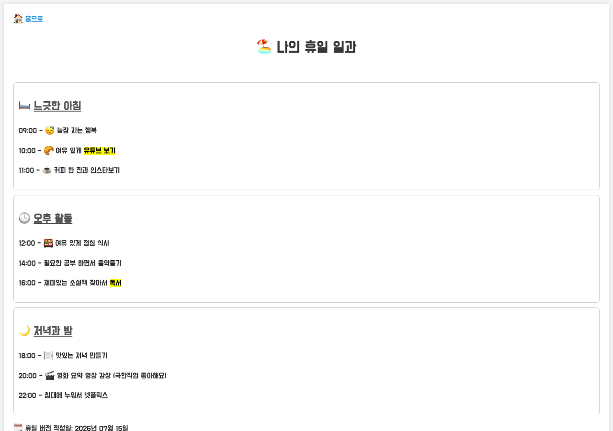
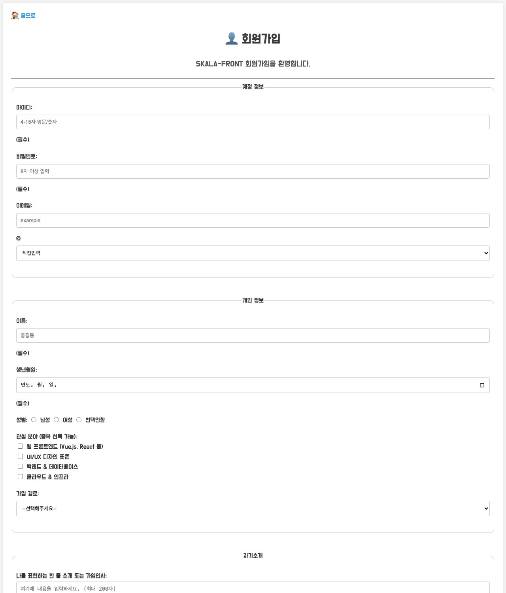

# SKALA-FRONT

SKALA 프론트엔드 과정에서 진행한 HTML/CSS/JavaScript 실습 및 과제 모음입니다. 개인 홈페이지 컨셉으로 여러 페이지와 미니 게임, 실시간 날씨 API 연동 등을 담고 있습니다.

## 시작하기

별도의 빌드 과정이나 서버가 필요 없는 정적 페이지입니다. `html/index.html`을 브라우저로 열면 됩니다.

```bash
open html/index.html   # macOS
```

## 🔗 배포 사이트 바로가기
[사이트 보러가기](https://hemu0-0.github.io/skala-front/html/index.html)

> 날씨 기능은 `fetch`로 외부 API를 호출하므로, `file://`로 열면 브라우저 정책에 따라 막힐 수 있습니다. 이 경우 Live Server 등 로컬 서버로 실행하세요.

## 프로젝트 구조

```
html/     페이지 (index, myClass, myProfile, myTrip, holiday, signUp, signUpResult)
css/      전체 공통 스타일 (style.css)
script/   페이지별 동작 스크립트
media/    이미지, 오디오, 비디오 리소스
```

## 페이지 구성

### 홈 (index.html)
공지사항, 이달의 사진, 실시간 정보(포지션·음악 재생), 실시간 세계 날씨, 게임 존(업다운/성적계산기/가방보기/하치와레 잡기)으로 구성된 메인 랜딩 페이지



### 나의 수업 (myClass.html)
주간 강의 시간표 (테이블)



### 나의 프로필 (myProfile.html)
자기소개 (좋아하는 것, 올해 할 일, 나를 표현하는 단어)



### 나의 여행 (myTrip.html)
여행 사진 앨범 및 브이로그 영상



### 나의 휴일 (holiday.html)
휴일 일과표



### 회원가입 (signUp.html / signUpResult.html)
회원가입 폼과 결과 안내 페이지



## 주요 기능 (script/)

| 파일 | 설명 |
| --- | --- |
| `upDown.js` | 1~50 숫자 업다운 게임 (`prompt`/`alert` 기반) |
| `grade.js` | 과목별 점수 입력 후 총점/평균 계산 및 합격 여부 판정 |
| `bag.js` | 가방 속 아이템 목록을 `alert`로 출력 |
| `play.js` | 캐릭터 이미지 클릭 시 유튜브 iframe 재생/정지 토글 |
| `catchGame.js` | 10초 동안 떨어지는 캐릭터를 클릭해 점수를 얻는 캐치 게임 |
| `weatherAPI.js` | Open-Meteo API 호출 모듈 (도시별 좌표 → 기온/습도 반환) |
| `realtimeInfo.js` | `weatherAPI.js`를 불러와 도시 선택에 따라 실시간 날씨를 렌더링 (ES 모듈) |
| `weather.js` | 날씨 API 호출을 모듈 분리 이전 버전의 단일 파일 구현 (참고용, 미사용) |

## 기술 스택

- Vanilla HTML5 / CSS3 / JavaScript (ES Modules)
- [Open-Meteo API](https://open-meteo.com/) — 무료 실시간 기상 데이터